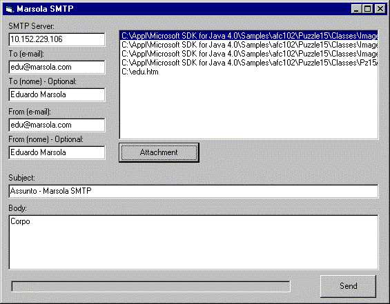



## Marsola SMTP

### Description

Send e-mails WITH ATTACHMENT files via SMTP Server with just WINSOCK connection...

Very good code... it uses BASE64 Encode and BASE64 Decode, MIME Version 1.0...

SMTP ATTACHMENT FILE WITH WINSOCK CONNECTION!!!

Really easy!
 
### More Info
 
SMTP Server,

To e-mail,

from e-mail,

subject,

body,

attachments,

             |
---                |---
**Submitted On**   |2004-04-16 17:16:02
**By**             |[Eduardo Marsola](https://github.com/Planet-Source-Code/PSCIndex/blob/master/ByAuthor/eduardo-marsola.md)
**Level**          |Advanced
**User Rating**    |4.7 (33 globes from 7 users)
**Compatibility**  |VB 5\.0, VB 6\.0
**Category**       |[Internet/ HTML](https://github.com/Planet-Source-Code/PSCIndex/blob/master/ByCategory/internet-html__1-34.md)
**World**          |[Visual Basic](https://github.com/Planet-Source-Code/PSCIndex/blob/master/ByWorld/visual-basic.md)
**Archive File**   |[Marsola\_SM1734234162004\.zip](https://github.com/Planet-Source-Code/eduardo-marsola-marsola-smtp__1-53202/archive/master.zip)

